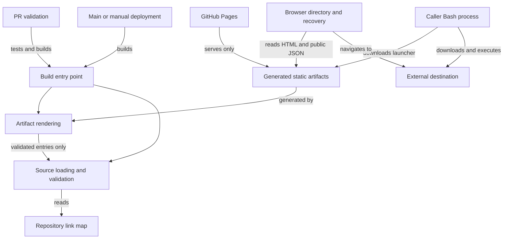
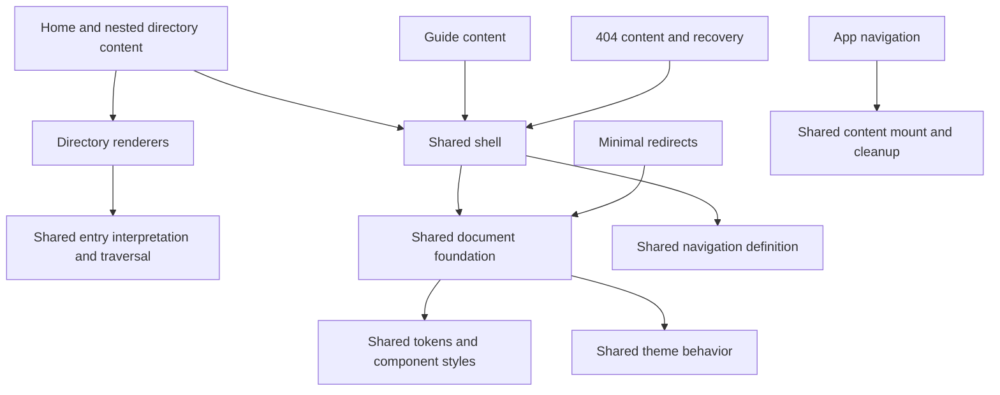
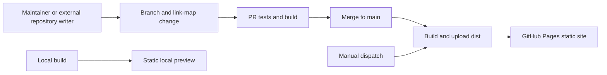

# Architecture Spine — Shortlink

## Design Paradigm

**Component composition within static-site generation and progressive enhancement.** Pure renderers compose shared foundations and responsibility-owned components into static documents. Browser modules enhance them; Bash launchers execute external destinations on the caller's machine.

Existing-system evidence was refreshed against `053844fe08b546f6a4690c029d19b09d00a92822`; AD-7–AD-9 bind the approved modular consistency change in `spec-modular-ui.md`. File organization and runtime pins are code-owned seed.

AD-7–AD-9 are verified against this task's working tree, not claimed to exist in that baseline commit. The approved modularity task adds no dependencies; AD-1's general future-extension allowance does not override stricter task constraints.

## Invariants & Rules

### AD-1 — Static operation and state ownership [ADOPTED]

- **Binds:** All units and future extensions.
- **Prevents:** Server-backed features, competing link stores, and visitor preferences becoming shared published state.
- **Rule:** Publish one static site with no application backend, database, or application authentication. Maintainers and external automations mutate the repository link map through repository workflows; visitors cannot mutate published links. Destination access control belongs to the destination host. Search state stays in the page; theme preference stays in the browser. Internal modules and templating may change for maintainability or extensibility while preserving this spine's published contracts. Prefer standard-library/native facilities and installed dependencies; an added dependency must address a concrete need those cannot reasonably cover. Do not introduce a frontend framework. Built-in click tracking is outside current scope.

### AD-2 — One link contract across producers and consumers [ADOPTED]

- **Binds:** Source loading, validation, rendering, browser recovery, and machine-readable publication.
- **Prevents:** Format-specific semantics, independently maintained indexes, and disagreement about directories versus links.
- **Rule:** Exactly one root `links.json`, `links.yaml`, or `links.yml` is authoritative. JSON and YAML accept the same nested map: a URL string or object containing `url` is a link; an object without `url` is a nonempty directory. The root may be empty. Link objects accept optional string `title`, and an array of nonblank string `tags`; the `script` tag enables a launcher. Reject every legacy `hidden` and `script` property. Derive hidden/broken/disabled/script leaf states from exact trimmed case-insensitive tags, without inheritance. Destinations, including disabled ones, must parse as absolute HTTP(S) URLs. Generate public `dist/links.json` from that same validated map, preserving nesting, keys, casing, and configured values. Listings, redirects, launchers, and recovery derive from this source. Hidden entries remain public and routable unless disabled; ordinary listings/search/counts omit them until toggled, while exact state searches temporarily reveal matching hidden leaves and ancestors. Hiding is discoverability, not secrecy; disabling controls shl forwarding/execution, not external access.

### AD-3 — One namespace and hosting-independent routing [ADOPTED]

- **Binds:** Validation, emitted paths, directory navigation, redirects, and 404 recovery.
- **Prevents:** Ambiguous sibling lookup, generated-file collisions, and routing that works only at a site root.
- **Rule:** Every segment matches `^[A-Za-z0-9][A-Za-z0-9._-]*$`. Reject case-insensitive sibling collisions and reserved names, including generated filenames, before writing output. A path cannot be both directory and redirect. Preserve code casing in emitted directories. Browser links use relative paths and work at both `/` and `/<repo>/` without base-URL configuration. Enabled links emit `<path>/index.html` with JavaScript navigation, meta refresh, and a clickable fallback, not HTTP 301/302. Disabled leaves emit shared minimal explanations without forwarding, destination canonical links, or external fallback. When Pages serves `404.html`, recovery fetches the public map and matches every relative segment case-insensitively: enabled links go to their destinations, disabled links to canonical short URLs, directories to canonical-cased directory URLs. Unknown or unavailable-map requests show a not-found state. Launchers are separate `<path>.sh` resources requiring exact casing and no trailing slash, including inert disabled launchers; HTML redirects and 404 recovery are not launcher aliases.

### AD-4 — Validate before replacement; encode at each output boundary [ADOPTED]

- **Binds:** Builder and all HTML, inline-script, and Bash generators.
- **Prevents:** Destructive invalid builds, configuration-driven code injection, and execution of partial downloads.
- **Rule:** Finish source/schema/path/URL/collision validation before deleting existing `dist/`, including disabled entries. A successful build recreates output completely, removing stale resources. This is validation-before-replacement, not atomic recovery from later write failures. Do not imply destination reachability or script correctness checks. Escape values for HTML; inline JavaScript serialization must neutralize HTML script-closing sequences; Bash destinations must be shell-quoted. Enabled launchers download completely before invoking Bash, forward arguments and exit status, prevent execution after a failed download, and remove their temporary file on exit. Disabled launchers print the specified explanation to stderr and exit 1 without download, payload creation, execution, or argument processing. These guarantees cover current artifacts, not older retained copies. Neither version selection nor private-resource credentials are supplied by Shortlink.

### AD-5 — Browsing is baseline; client behavior is enhancement [ADOPTED]

- **Binds:** Directory pages, guide, search, theme, and browser recovery.
- **Prevents:** A JavaScript-only library, remote search state, and inconsistent visitor-state ownership.
- **Rule:** Static HTML supports browsing and expandable nested directories without JavaScript. Every directory has a browseable page and breadcrumbs; names sort case-insensitively within each group. Plain search is one case-insensitive broad substring using recorded codes, titles, destinations, tags, and nested folder names. Initial `#` selects an exact whole leaf tag; spaces remain part of its label and bare `#` matches nothing. Ordinary search respects the hidden toggle; exact hidden/broken/disabled tag queries temporarily include matching hidden leaves and ancestors without changing that toggle. Search stays available in every nonempty subtree, including all-hidden pages. Reveal matching descendants through their ancestor groups; update the single live count and no-match state. Keep semantic links/disclosures, labeled search, visible keyboard focus, code/destination pairing, full destinations for assistive technology, and a Download action identifying script links alongside color. Disabled destinations are copy-only selectable controls without external href or native navigation fallback; Open/Download are disabled controls, and both URL copies remain available. Tags use native inline disclosure without shifting rows. Copy feedback is a polite non-displacing status. Exact content styling belongs to `DESIGN.md` under AD-8. `/about/` and `/how-it-works/` remain forwards to Guide sections. Search, copy, and wrong-case recovery are enhancements; recovery needs map retrieval. Theme and lifecycle ownership follow AD-9.

### AD-6 — Repository checks and static publication own operations [ADOPTED]

- **Binds:** PR validation, build entry point, artifacts, and deployment.
- **Prevents:** Deploying source/tooling, assuming deploy-time tests, or adding an application-service environment.
- **Rule:** Run builds from the repository root. PR validation targeting `main` installs dependencies, runs the regression suite, then builds; the existing `AGENTS.md`-only exception skips both. Pushes to `main` or manual dispatch install, build, and deploy only `dist/` to GitHub Pages; deployment does not rerun regression tests. Include `.nojekyll` and copy an optional root `CNAME`. Repository rulesets control merge requirements; DNS, domain selection, and HTTPS setup remain external hosting configuration. A local preview is a static artifact preview, not an application environment. Routing changes require the existing root/project-prefix checks and a deployed browser smoke test because simulated browser tests do not establish Pages 404 behavior.
- **Rendered check execution:** CI runs browser checks in required mode; browser absence is a verification failure, not a skip. Ordinary optional local suite runs do not substitute for AD-9's executed rendered evidence.

### AD-7 — Compose single-owner components and foundations [ADOPTED]

- **Binds:** All document producers, directory rendering, and shared data interpretation.
- **Prevents:** Copied document wrappers, shell/row markup, traversals, and inconsistent string/object link interpretation.
- **Rule:** Every HTML page composes one shared document foundation. Home, nested directories, Guide, and 404 compose one header/navigation/theme-control/footer shell; pages supply content inside main. Destination and legacy redirects use the minimal-document variant without chrome, retaining the same foundations and shared forwarding responsibility. Reuse directory tools, groups, rows, and tag disclosure renderers wherever those responsibilities recur. Share pure entry interpretation and traversal helpers across their consumers; validation stays at the input boundary. Do not copy logic, layout, or styling for the same responsibility. Keep unique content local; extract actual repetition rather than speculative wrappers. Use plain ES-module composition, not a framework, component registry, or universal renderer. Context-specific output encoding remains mandatory under AD-4.
- **Dependency boundary:** Keep the import graph acyclic. Pages/components depend on foundations and pure helpers; those foundations do not import their composing pages. Build-time helper co-location with loading/validation is allowed, but generated browser code cannot require filesystem, YAML, or builder capabilities. Extract a neutral leaf only when shared consumers need it to preserve dependency direction.
- **Data boundary:** Treat validated raw entries and borrowed directory slices as read-only through publication. Detached view projections belong to their view; reusable shared projections are read-only. Transient controllers cannot mutate the source snapshot or attach state to a shared cached projection. No cloning/freezing framework or cache is required.

### AD-8 — Consistent component styling, independent of page identity [ADOPTED]

- **Binds:** Shared chrome, theme tokens, controls, content styles, and design instructions.
- **Prevents:** Identical components appearing differently through body classes, page selectors, copied declarations, or locally documented exceptions.
- **Rule:** Theme roles and each component's shared declarations have one owner. Shared chrome has identical geometry, typography, spacing, colors, controls, and responsive behavior at equal viewport/theme across every shell page, except active navigation state. Header/footer are borderless everywhere; Guide content separators remain local to its content. Page content styles stay within main and cannot restyle chrome. Variants express component purpose or state (script action, disabled control, minimal redirect), never page identity. A change to this invariant requires an explicit architecture amendment, synchronized design/agent rules, and affected checks; documenting a local override is insufficient.

### AD-9 — One browser lifecycle and rendered consistency gate [ADOPTED]

- **Binds:** Theme, content mounting, navigation, recovery, and shared-component verification.
- **Prevents:** Duplicate listeners, stale content behavior, theme drift, positional coupling of behavior to visual classes, and markup-only consistency claims.
- **Rule:** Theme is document/shell-lifetime: share storage-tolerant restoration on every document, including without a control. CSS system preference is baseline; JavaScript restores saved overrides and keeps the control label consistent. Cross-page app navigation cleans outgoing asynchronous behavior before main replacement, then mounts content once, resetting search, hidden visibility, and folder disclosures. Same-page/fragment navigation does not remount/reset. Preserve title/active navigation, accessible focus, history/fragments, stale-request suppression, native failure fallback, and the existing per-URL scroll restoration limit. Theme and shell survive transitions. 404 recovery and minimal forwarding are direct-document behaviors outside app mounting; native links remain functional without JavaScript.
- **Component integration:** Renderers and behavior share an owner-published contract: href/download semantics, disclosure targets, copy kind, pressed/disabled state, and consumed hooks must change together. Existing structural component classes/IDs may be dual-use contracts; a behavior must not borrow an unrelated control's visual class or depend on control order. Theme therefore has its dedicated hook rather than selecting the hidden toggle's shared styling class.
- **Recovery boundary:** 404 embeds shared styles/theme because its requested asset base is unknown. After the first readable ancestor map, rebase site-local shell links and stop probing even if no entry matches; use native navigation. Without a readable map or JavaScript, retain relative fallback without claiming a known project root. Requests have no application-level deadline; final not-found state depends on request completion.
- **Verification gate:** Verify structure and real computed appearance across home, nested directories, Guide, and 404 in light/dark and desktop/mobile, including direct/native loads and applicable app transitions. Verify minimal redirect foundations and root/project-prefix recovery separately. Reuse the existing harness; a skipped/unavailable browser check does not satisfy rendered verification. Record an executed, successful affected matrix before declaring the gate complete.

### Dependency direction

Arrows identify what each unit depends on. Published consumers cannot write back to the source map or require the builder at request time.

The diagrams project responsibility dependencies rather than exhaustively enumerate allowed imports; AD-7's acyclic/capability boundaries apply to every edge.

## Consistency Conventions

| Concern | Convention |
| --- | --- |
| Namespace | Case-preserving output, case-insensitive sibling uniqueness and browser lookup. Reserve `index`, `404`, `assets`, `links`, `about`, `guide`, `how-it-works`, `index.html`, `404.html`, `links.json`, and `cname` in any casing; reject launcher filename collisions. |
| Shared data | Directory/link distinction is the presence of `url`, not depth or filename. Public JSON preserves validated input shape; title/tags and derived leaf-state semantics match across formats and consumers. No legacy hidden or script property. |
| Component ownership | Shared document/shell, directory components, styles/tokens, browser lifecycle, and entry interpretation each have one owner. Pages compose; they do not fork shared responsibilities. |
| Variants | Purpose/state belongs to a component; page identity cannot alter shared chrome. Minimal redirect omits chrome rather than redefining it. |
| Mutation | Repository edits publish on the next deployment; retargeting preserves the code path, deletion removes generated resources on successful publication. No application editing endpoint or embedded writer credentials. |
| Errors and trust | Invalid input exits nonzero before output replacement; unknown browser paths end in a readable fallback. Escape at the consuming context rather than treating validated URLs as safe code. |

## Stack

Observed repository pins, reality-checked on 2026-10-07; these are not claims of latest available releases.

| Name | Version |
| --- | --- |
| Bun build/test runtime | 1.4.2 in package metadata and CI |
| `yaml` build dependency | 2.9.1 in lockfile; package range `^2.8.1` |

Generated HTML/CSS/JavaScript require no frontend package runtime. Launchers require Bash, curl, mktemp, and rm. Rendered checks use installed Chrome; its version is not pinned by the application. GitHub Pages/Actions are hosted services, not repository-versioned runtime dependencies.

Verification sources: `package.json`, `bun.lock`, both workflows, `bun --version`, and passing `bun ci`/baseline tests. Existing Pages fit was verified in the original run against [Pages static hosting and site types](https://docs.github.com/en/pages/getting-started-with-github-pages/what-is-github-pages); no new platform is selected.

## Structural Seed

`build.mjs` forwards to `src/build.mjs`; `src/links.mjs` owns loading/validation, `src/layout.mjs` owns document/shell composition, `src/directory.mjs` owns directory components, `src/pages.mjs` owns unique page content and forwarding/recovery, `src/styles.mjs` owns styles/tokens, and `src/browser.mjs` owns browser behaviors. `test/build.test.mjs` runs with `bun test --timeout 30000 ./test/build.test.mjs`. Responsibility ownership is binding; filenames may change together with callers and instruction pointers. There is no configured staging site or separate application infrastructure. Hosting policies remain configuration, not implied by the diagrams.

## Deferred

- **Further component extraction:** Add boundaries only for a repeated or independently changing responsibility; preserve AD-7–AD-9. Do not introduce speculative registries or a framework.
- **Performance targets and scale evidence:** The approved PRD expects hundreds of links but supplies no measured capacity or latency target. Maintainer revisits when the library grows or search slows; no indexing service is implied.
- **External automated writers:** GitHub's repository API is the selected external editing approach, not an implemented Shortlink API client. The automation maintainer settles credentials, permissions, and concurrent repository edits when setting up the first writer; repository-owned publication remains binding.
- **Future product extensions:** New editing conveniences and taxonomy guidelines need separate feature decisions. Hidden listing and searchable tags already follow AD-2/AD-5; all configured entries remain public.
- **Build write-failure recovery:** Revisit staged/atomic output replacement only if recovery from failures after validation becomes a requirement; current output-integrity guarantees stop at validation-before-deletion.
- **Bounded 404 recovery:** Add a request deadline if maintainers require bounded completion under stalled networks; current theme/native shell is usable while recovery waits, with no latency promise.
- **Other providers, environments, and operations:** Revisit staging, provider portability, monitoring, and availability targets when deployment needs change. Today operations use repository checks and GitHub Pages deployment; no service-level guarantee or managed application fleet is asserted.
