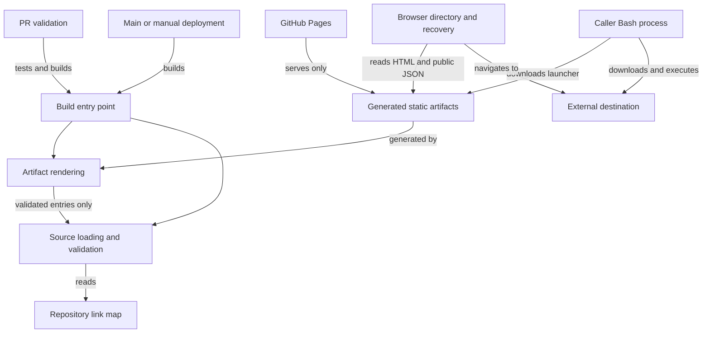
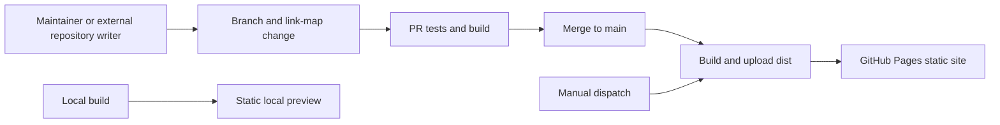

# Architecture Spine — Shortlink

## Design Paradigm

**Static-site generation with progressive enhancement.** The build compiles a repository-owned link map into a public static site. Browser scripts enhance those artifacts; Bash launchers execute external destinations on the caller's machine.

This spine ratifies the system at `main` commit `7b2e8d9`. Its invariants bind future changes; file organization and version details are code-owned seed.

## Invariants & Rules

### AD-1 — Static operation and state ownership [ADOPTED]

- **Binds:** All units and future extensions.
- **Prevents:** Server-backed features, competing link stores, and visitor preferences becoming shared published state.
- **Rule:** Publish one static site with no application backend, database, or application authentication. Maintainers and external automations mutate the repository link map through repository workflows; visitors cannot mutate published links. Destination access control belongs to the destination host. Search state stays in the page; theme preference stays in the browser. Internal modules and templating may change for maintainability or extensibility while preserving this spine's published contracts. Prefer standard-library/native facilities and installed dependencies; an added dependency must address a concrete need those cannot reasonably cover. Do not introduce a frontend framework. Built-in click tracking is outside current scope.

### AD-2 — One link contract across producers and consumers [ADOPTED]

- **Binds:** Source loading, validation, rendering, browser recovery, and machine-readable publication.
- **Prevents:** Format-specific semantics, independently maintained indexes, and disagreement about directories versus links.
- **Rule:** Exactly one root `links.json`, `links.yaml`, or `links.yml` is authoritative. JSON and YAML accept the same nested map: a URL string or object containing `url` is a link; an object without `url` is a nonempty directory. The root may be empty. Link objects accept an optional string `title` and boolean `script`; only `script: true` enables a launcher. Destinations must parse as absolute HTTP(S) URLs. Generate public `dist/links.json` from that same validated map, preserving nesting, keys, casing, and configured destinations. Listings, redirect pages, launchers, and recovery must derive from this source; all entries are public and listed today.

### AD-3 — One namespace and hosting-independent routing [ADOPTED]

- **Binds:** Validation, emitted paths, directory navigation, redirects, and 404 recovery.
- **Prevents:** Ambiguous sibling lookup, generated-file collisions, and routing that works only at a site root.
- **Rule:** Every segment matches `^[A-Za-z0-9][A-Za-z0-9._-]*$`. Reject case-insensitive sibling collisions and reserved names, including generated filenames, before writing output. A path cannot be both directory and redirect. Preserve code casing in emitted directories. Browser links use relative paths and work at both `/` and `/<repo>/` without base-URL configuration. Each link emits `<path>/index.html` with JavaScript navigation, meta refresh, and a clickable fallback, not HTTP 301/302. When Pages serves `404.html`, recovery fetches the public map and matches every relative segment case-insensitively: links go to their destinations, directories to canonical-cased directory URLs. Unknown or unavailable-map requests show a not-found state. Launchers are separate `<path>.sh` resources requiring exact casing and no trailing slash; HTML redirects and 404 recovery are not launcher aliases.

### AD-4 — Validate before replacement; encode at each output boundary [ADOPTED]

- **Binds:** Builder and all HTML, inline-script, and Bash generators.
- **Prevents:** Destructive invalid builds, configuration-driven code injection, and execution of partial downloads.
- **Rule:** Finish source/schema/path/URL/collision validation before deleting existing `dist/`. A successful build recreates output completely, removing stale resources. This is validation-before-replacement, not atomic recovery from later write failures. Do not imply destination reachability or script correctness checks. Escape values for HTML; inline JavaScript serialization must neutralize HTML script-closing sequences; Bash destinations must be shell-quoted. Launchers download completely before invoking Bash, forward arguments and exit status, prevent execution after a failed download, and remove their temporary file on exit. They execute the configured destination each run; neither version selection nor private-resource credentials are supplied by Shortlink.

### AD-5 — Browsing is baseline; client behavior is enhancement [ADOPTED]

- **Binds:** Directory pages, guide, search, theme, and browser recovery.
- **Prevents:** A JavaScript-only library, remote search state, and inconsistent visitor-state ownership.
- **Rule:** Static HTML supports browsing and expandable nested directories without JavaScript. Every directory has a browseable page and breadcrumbs; names sort case-insensitively within each group. Search filters only the current page's subtree, case-insensitively, using recorded codes, titles, destinations, and nested folder names; it does not index destination content. Reveal matching descendants by expanding their ancestor groups, announce counts/no matches, and restore visibility when clearing search. Directory and guide share theme semantics: system preference by default, with a browser-local override that tolerates unavailable storage. Search and wrong-case recovery require JavaScript; recovery also needs map retrieval. Keep semantic links/disclosures, labeled search, visible keyboard focus, visible code/destination pairing, full destinations available to assistive technology, and text identification of scripts alongside color. Preserve the compact, reference-first Working Index direction, with discovery secondary; exact styling belongs to `DESIGN.md`. `/about/` and `/how-it-works/` remain forwards to guide sections.

### AD-6 — Repository checks and static publication own operations [ADOPTED]

- **Binds:** PR validation, build entry point, artifacts, and deployment.
- **Prevents:** Deploying source/tooling, assuming deploy-time tests, or adding an application-service environment.
- **Rule:** Run builds from the repository root. PR validation targeting `main` installs dependencies, runs the regression suite, then builds; the existing `AGENTS.md`-only exception skips both. Pushes to `main` or manual dispatch install, build, and deploy only `dist/` to GitHub Pages; deployment does not rerun regression tests. Include `.nojekyll` and copy an optional root `CNAME`. Repository rulesets control merge requirements; DNS, domain selection, and HTTPS setup remain external hosting configuration. A local preview is a static artifact preview, not an application environment. Routing changes require the existing root/project-prefix checks and a deployed browser smoke test because simulated browser tests do not establish Pages 404 behavior.

### Dependency direction

Arrows identify what each unit depends on. Published consumers cannot write back to the source map or require the builder at request time.

## Consistency Conventions

| Concern | Convention |
| --- | --- |
| Namespace | Case-preserving output, case-insensitive sibling uniqueness and browser lookup. Reserve `index`, `404`, `assets`, `links`, `about`, `guide`, `how-it-works`, `index.html`, `404.html`, `links.json`, and `cname` in any casing; reject launcher filename collisions. |
| Shared data | Directory/link distinction is the presence of `url`, not depth or filename. Public JSON preserves the validated input shape; optional titles and launcher flags have identical meaning in JSON and YAML. |
| Mutation | Repository edits publish on the next deployment; retargeting preserves the code path, deletion removes generated resources on successful publication. No application editing endpoint or embedded writer credentials. |
| Errors and trust | Invalid input exits nonzero before output replacement; unknown browser paths end in a readable fallback. Escape at the consuming context rather than treating validated URLs as safe code. |

## Stack

Observed seed, verified on 2026-10-04; these are not additional dependency pins.

| Name | Version |
| --- | --- |
| Node.js build/test runtime | 24 major in CI; 24.21.0 is the verified current LTS patch |
| `yaml` build dependency | 2.9.1 in lockfile; package range `^2.8.1` |

Generated HTML/CSS/JavaScript require no frontend package runtime. Launchers require Bash, curl, mktemp, and rm. GitHub Pages/Actions are hosted services, not repository-versioned runtime dependencies.

Verification sources: [Node releases](https://nodejs.org/en/about/previous-releases), [published YAML package](https://registry.npmjs.org/yaml/2.9.1), and [Pages static hosting and site types](https://docs.github.com/en/pages/getting-started-with-github-pages/what-is-github-pages). The lockfile and workflows own the actual installed/CI versions.

## Structural Seed

Current code lives in `build.mjs`; behavioral checks live in `build.test.mjs`, run with `node --test build.test.mjs`. Templates generate the assets and pages. Neither that single-file layout nor a fixed module tree is an invariant. There is no configured staging site or separate application infrastructure. Branch protection is recommended repository configuration, not established by the arrows above.

## Deferred

- **Internal layout and templating:** Choose module boundaries when a concrete maintenance/extension change needs them; preserve AD-1–AD-6 rather than standardizing a speculative tree.
- **Performance targets and scale evidence:** The approved PRD expects hundreds of links but supplies no measured capacity or latency target. Maintainer revisits when the library grows or search slows; no indexing service is implied.
- **External automated writers:** GitHub's repository API is the selected external editing approach, not an implemented Shortlink API client. The automation maintainer settles credentials, permissions, and concurrent repository edits when setting up the first writer; repository-owned publication remains binding.
- **Future product extensions:** Hidden listings, editing conveniences, and taxonomy guidelines require a separately scoped feature decision. Today all entries are listed/public and maintainers choose grouping within the existing namespace rules.
- **Build write-failure recovery:** Revisit staged/atomic output replacement only if recovery from failures after validation becomes a requirement; current output-integrity guarantees stop at validation-before-deletion.
- **Other providers, environments, and operations:** Revisit staging, provider portability, monitoring, and availability targets when deployment needs change. Today operations use repository checks and GitHub Pages deployment; no service-level guarantee or managed application fleet is asserted.
